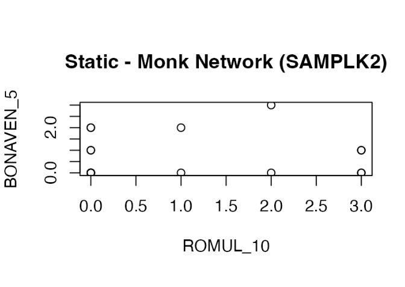

## 1. ERROR 1: WITH A STATIC PLOT

-   When I tried to make a static network plot, I initially ran **plot(samplk2, vertex.label..)** without converting it to an igraph object first.

**a. Errors:**

-   A wrong graph in a points-style plot, instead of a network.

    

-   24 warnings: use warnings() to see!

**b. Why it happened:**

-   Since samplk2 is a matrix, calling **plot(samplk2)** triggers base R’s default plot() method for matrices, which treats the matrix as regular numeric data (often producing a scatter/points-style plot), not a network visualization.

-   Besides, the warnings occurred because the extra plotting arguments I provided (meant for igraph network plots, like vertex/edge options) did not apply to base R’s matrix plotting, so R warned that those parameters were being ignored or misinterpreted.

**c. How I fixed it:**

-   I explicitly converted the adjacency matrix into an igraph object first, then plotted the igraph object.

## 2. Why do we need **arr.ind = TRUE** in which() when creating edges?

-   Without arr.ind = TRUE: result = a long vector & it's hard to tell which row and column the value came from.
-   With arr.ind = TRUE: result = 2-column matrix:
    a.  Column 1 = row index (sender).
    b.  Column 2 = column index (receiver).

## 3. ERROR 3: WITH A GENERATED MODEL

-   When I attempted to assign names to the monks in my generated_network matrix, I used: *rownames(generated_network) \<- paste("Monk", 1:length(generated_network))*

**a. Errors:**

-   An error indicating that the length of dimnames did not match the array extent.

**b. Why it happened:**

-   Because length() on a matrix returns the total number of elements (rows × columns), rather than the number of rows.
-   For example, for a 10 × 10 matrix, length() returns 100, which does not match the 10 available rows.
-   As a result, the number of row names did not match the number of rows, producing a mismatch error.

**c. How I fixed it:**

-   I changed length() to nrow().